# __Animorphs__

## __Project Outline__ 
- Our goal is to make a model architecture that can morph one object into another. We input two images (start and goal image) and the main task of our model is to use their latent space vectors of the two images to come up with intermediary latent vectors. Using these intermediary latent vectors, we create intermediary images by passing them into the StyleGAN. Finally, we will string together the start, intermediate images, and goal image to make a smooth .gif-like animation. 
- We prepared four datasets (each capturing different objects) to test our model on. We will first start with human faces, then Wikiart, then cars, and finally cats.

## __Model Architecture__ 
For this project, we mainly use StyleGAN.
### __Style Generative Adversarial Network(styleGAN)__
For the four objects, we use the StyleGAN created by NVIDIA. The model has the following architecture:

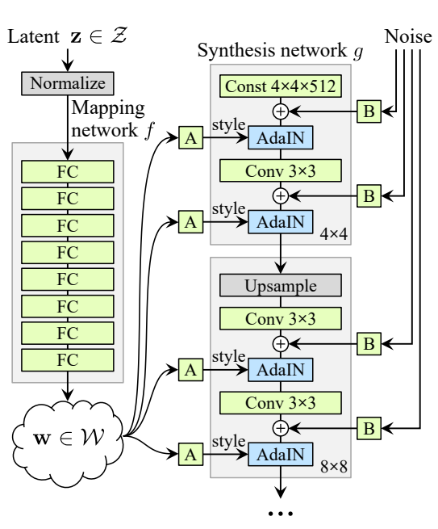

Unlike traditional GAN where we get the latent vector from feed forward network, the StyleGAN gets the latent vector by using two different networks, mapping network and synthesis network. For the mapping network, style-based Generator uses 8-layer MLP. The output from the mapping network is a vector that defines the styles that is integrated at each point in the generator model via a new layer called adaptive instance normalization(AdaIN), which is defined as:
$$\begin{align}
AdaIN(x_{i}, y) = y_{s,i} \frac{x_{i}-\mu(x_{i})}{\sigma(x_i)} + y_{b,i}
\end{align}$$ 
where $y_{s}, y_{b}$ are styles learned in the affine transformation.
The use of this style vector gives control over the style of the generated image. The AdaIN layers involve first standardizing the output of feature map to a standard Gaussian, then adding the style vector as a bias term.
This unique architecture allows us to have a control over the style of generated images at different levels of detail.

## __Dataset__
### __1. Human Face Dataset__
- For human faces, we take advantage of the pre-trained StyleGAN model built by NVIDIA. Since we can generate an image from any vector now, the image generation part was taken care of. Now we had to encode our start and goal images into the latent space of the StyleGAN to obtain the intermediary latent vectors. We try to approximate using two methods.
#### __Latent Vector Approximation using MSE__
- This is our first naive approach where the steps are described below.
  1. Initialize a random vector, $w$, of dimension $[1, 18, 512]$ and minimal loss vector $w_{min}$ of same dimension to $\vec{0}$ (only in the first iteration)
  2. Pass in the vector, $w$, to generator $G$ of styleGAN model.
  3. Compare the image $I_{w}$, the original image, and the generated image, $I_{G(w)}$, using MSE loss.
  4. If the loss is the smallest we have seen so far, do the update, $w_{min} = w$ and go back to step 1.
   
- With this method we were able to achieve the results below with five input images.
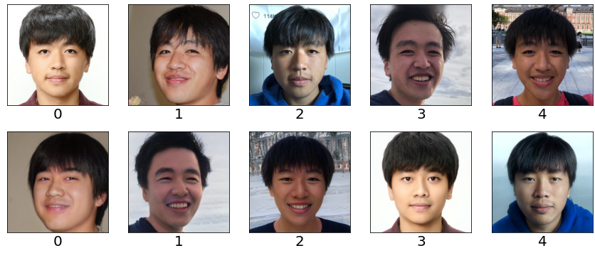
(0 maps to 3, 1 -> 0, 2 -> 4, 3 -> 1, 4 -> 2)

#### __Latent Vector Approximation using e4e__
- This new technique, which was published [here](https://arxiv.org/pdf/2102.02766.pdf), is a more generalized version where if you pass in an image, you can immediately get its latent vector (Note that our first approach requires us to compute one image at a time so it is very inefficient hence naive). The model structure is as follows:
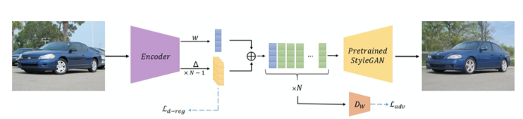 
- The steps are:
  - You pass in an image to the encoder, $E$, and it outputs a latent vector, $w$, and $N$ offsets (for face $N=18$, which is the size of second dimension), $\delta$. We combine these two 
  and pass it into the generator $G$ of the pre-trained StyleGAN model.
  - We again compute the MSE loss of the original image and generated image. However, at the same time, we also set the loss for our offsets $\delta$ and we try to minimize these two losses.
  - We update the learnable parameters in the encoder, $E$.
  
- With this method the following results were achieved in less than 3 seconds:
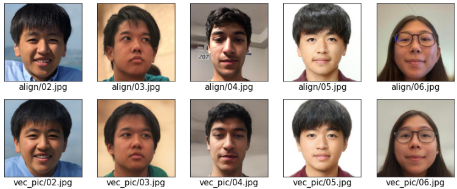  

### __2. WikiArt Dataset__
- For WikiArt Dataset, since we did not have the pre-trained StyleGAN model published by NVIDIA, we attempted to train our own model using Google Cloud Platform.
- We used the WikiArt dataset on Kaggle that is available [here](https://www.kaggle.com/competitions/painter-by-numbers/data).
- We tried following the steps listed in the README.md of the [official styleGAN implementation](https://github.com/NVlabs/stylegan) and trained the network with 4 GPUs. However, on the third day, our GCP crashed and all the weights were lost and we decided to use this [checkpoint](https://mega.nz/file/PsIQAYyD#g1No7FDZngIsYjavOvwxRG2Myyw1n5_U9CCpsWzQpIo) we came across online.
- Using the model obtained from the above checkpoint, here are some results produced by the generator of styleGAN.

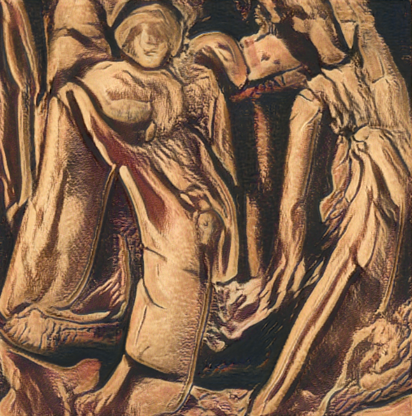
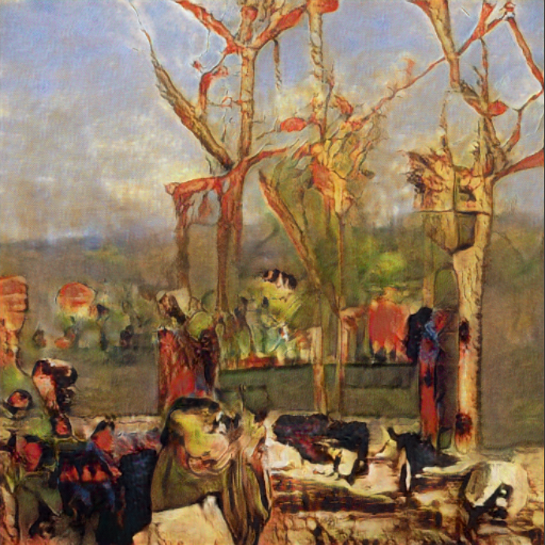
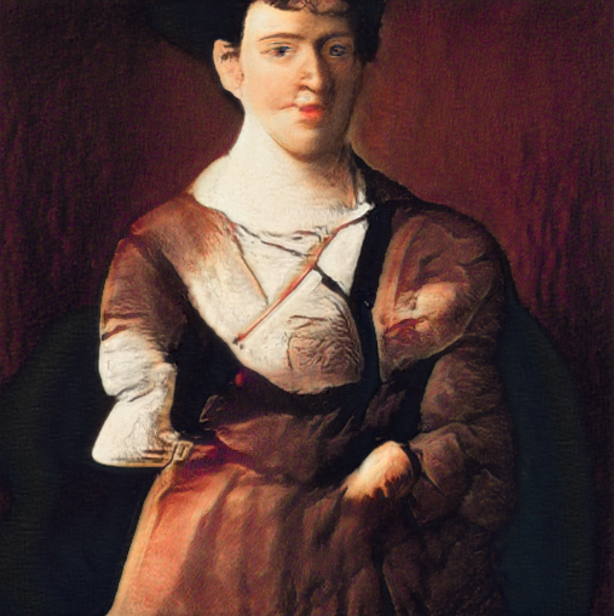
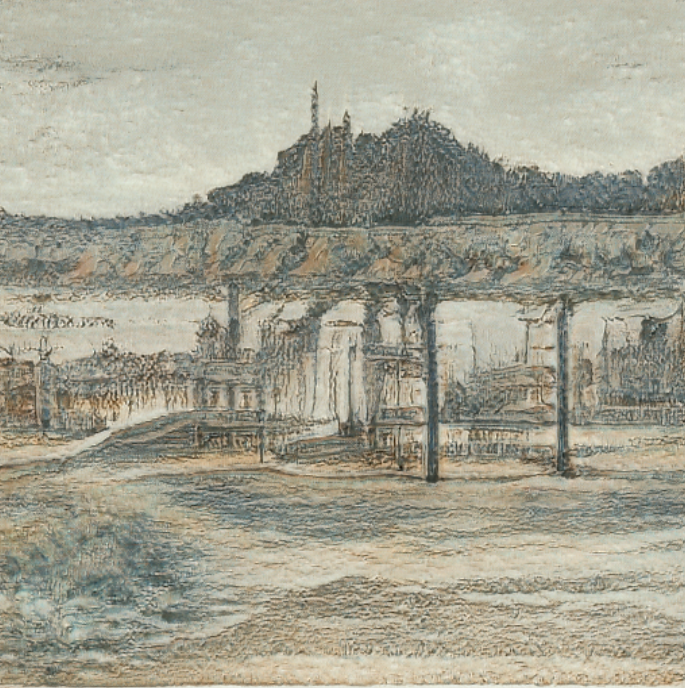
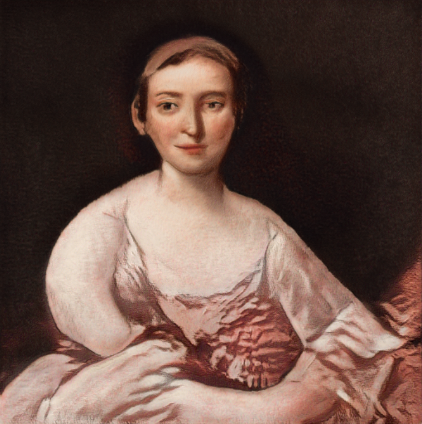
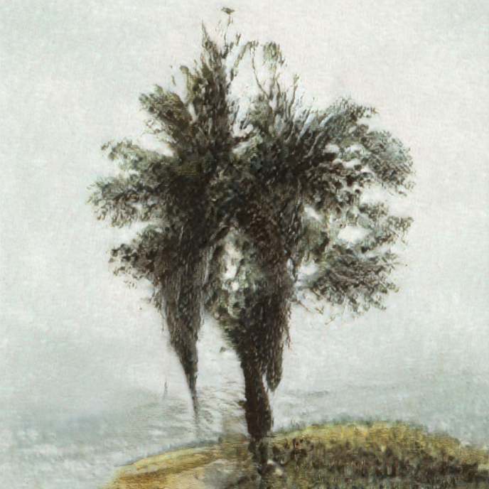

- From the results, we can see that the model performs pretty well in producing impressionist/nature-inspired art. However, when we take a look at the portrait arts produced by the generator, we can immediately observe that the face and body of the person depicted are warped and distorted.

- Now we will try to approximate the latent vector of any image. To do this, we will do the same naive approach proposed above where we try to minimize the MSE loss between $w$ and $w_{G(w)}$.
The image below is the result of this approach

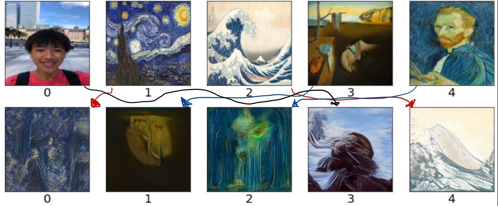

- As you might be able to tell from the approximated images, the results are not the best, but we can still see the effect. We can first see that with human face, the generator $G$ produced something very different. However, with paintings that depict waves or tower structures, the approximated images capture somewhat more accurately of the presence of the such objects.

### __3. Car Dataset__
- For car dataset, we used the pre-trained StyleGAN model published by NVIDIA.
- Using the model, we obtain the following results by passing in random six vectors to the generator.

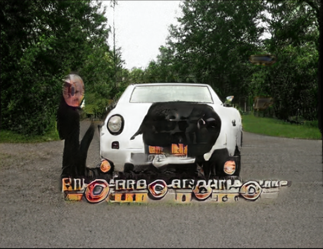
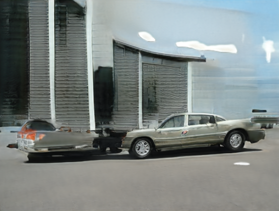
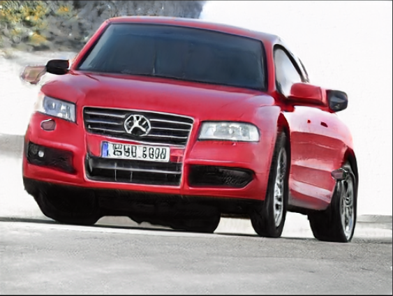
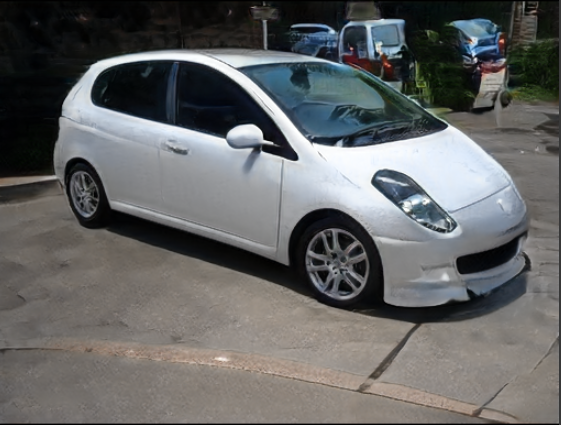
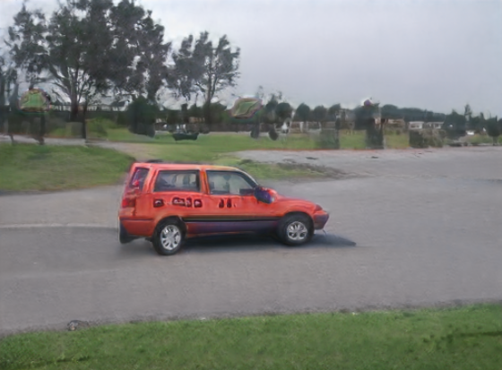
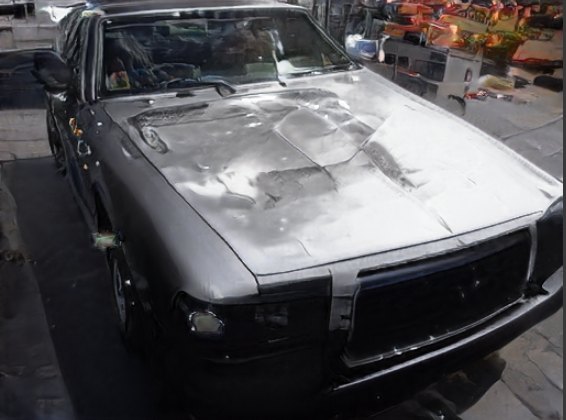

### __4. Cat Dataset__
- As for our fourth and final dataset, we used the cat dataset. For this, we were fortunate in that NVIDIA already published the pre-trained StyleGAN model so that we could use that to generate any cat images.
- One thing to note is that since there were huge variations in the images in the cat dataset (size, pose, color, skin, etc.) the output images are sometimes very warped and barely resemble the cat we think of.
- Using the model, we obtain the following results by passing in any six vectors to the generator.

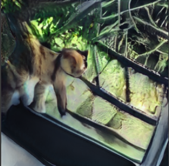
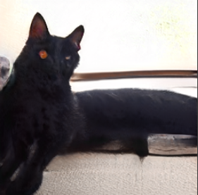
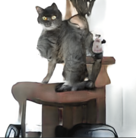
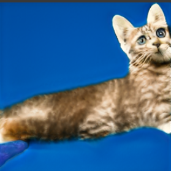
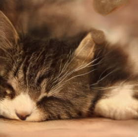
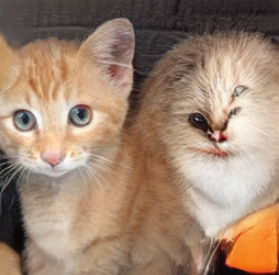

- As we can observe, although we can tell it is an image of an cat, some images are very distorted

- Since the StyleGAN for cat dataset was trained on low resolution images, we were able to do some experiments on how well we will be able to approximate the latent vector of any image we selected. Here again, we will use the brute force method whereby we loop for certain steps and try to minimize the MSE loss between $w$ and $w_{G(w)}$. 
- Here are the two images we selected:

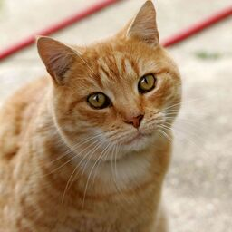
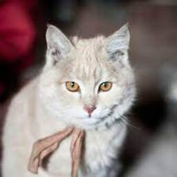

- For different number of steps(500, 1000, and 1500) we attempted to approximate these two images.

__500 steps__

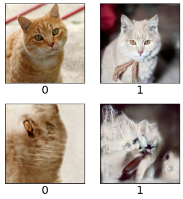

__1000 steps__

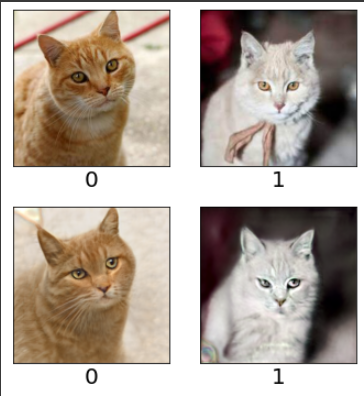

__1500 steps__

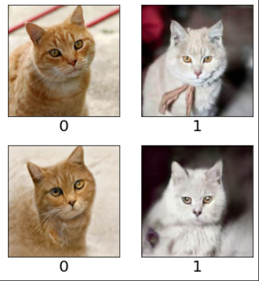

- We can clearly see that as we increase the number of generate images to explore, the better the resulting approximated images are. For 500 steps, we see objects that share the same color and general contour with the two images we selected, but they cannot be considered as cats. For 1000 steps, the approximated images look very much like the cats we inputted. However, minor details such as the shape of the face and the skin pattern are a little bit off. Finally for 1500 steps, the approximated images really look like the input cats, in that it captures small details like the eye color very well.
## Morphing 

- To be able to morph from one image to another, we researched ways to combine latent vectors. We decided to use linear interpolation to calculate intermediary vectors between two image coordinates. The formula for `linear interpolation` is defined as such:
$$\begin{align}
w_i = \alpha w_1 + (1-\alpha) w_2
\end{align}$$
- where $\alpha$ is the interpolation factor and $w_i$ is the interpolation vector. ($w_1$ and $w_2$ are the two latent vectors, one for start image and the other for goal image.) By running the generator on several $\alpha$ values, we can get same number of intermediary images, and by connecting them, obtain a smooth animation. 

### __Human Face Morphing__
- Using the 5 approximated images obtained in the naive method for Human Face, the following morphing was achieved:
  

- Additionally, with encoder4editor, we were now able to explore the latent space of the human faces dataset and 'edit' our image in certain directions. For our project, we have made it so that we can edit `age`, `pose`, and `age + pose` attributes.

Moving in `age` direction:

Moving in `pose` direction:

Moving in `age + pose` direction:

### __WikiArt Morphing__
- The following is the result of morphing various WikiArt images using `linear interpolation`(left is the start image, right is the goal image):
- The first two morphings are morphing from a randomly generated image to another randomly generated image.
__Morphing 1__:

start and end images

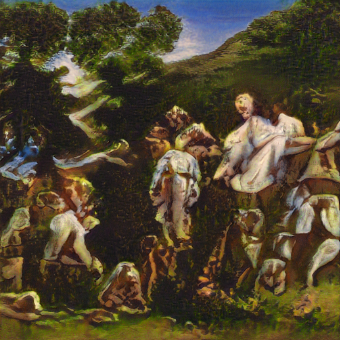
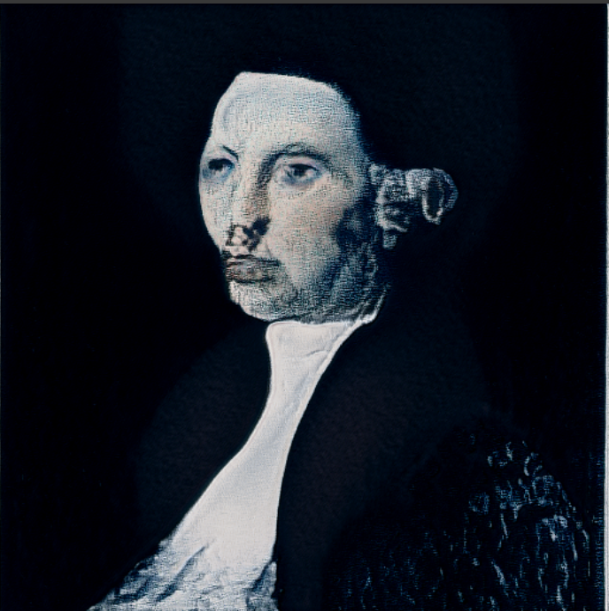

result morphing

__Morphing2__:

start and end images

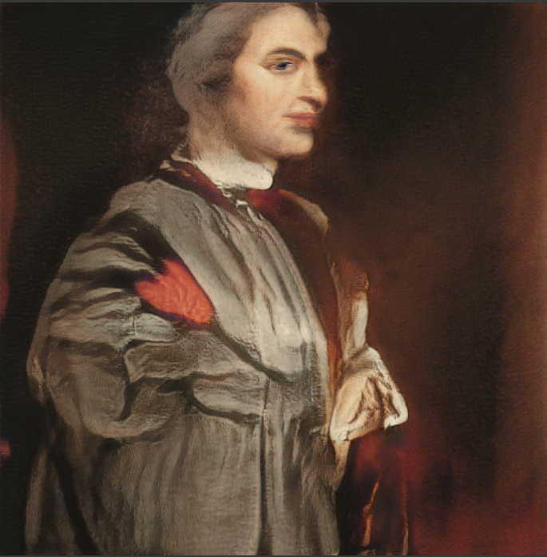
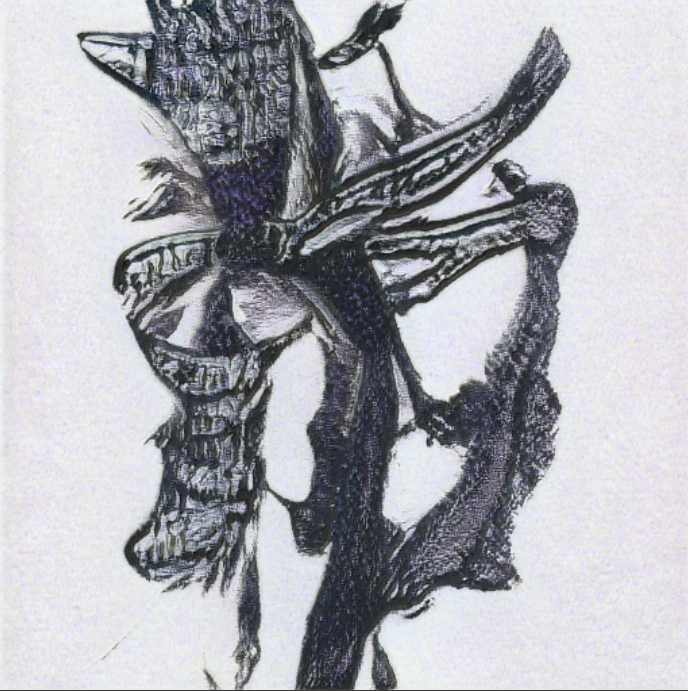

result morphing

__WikiArt Morphing3__:
- In the third one, we input two images, start and end, and create a morphing between the approximated images of the above two found using our naive method.

Start image and its approximated image

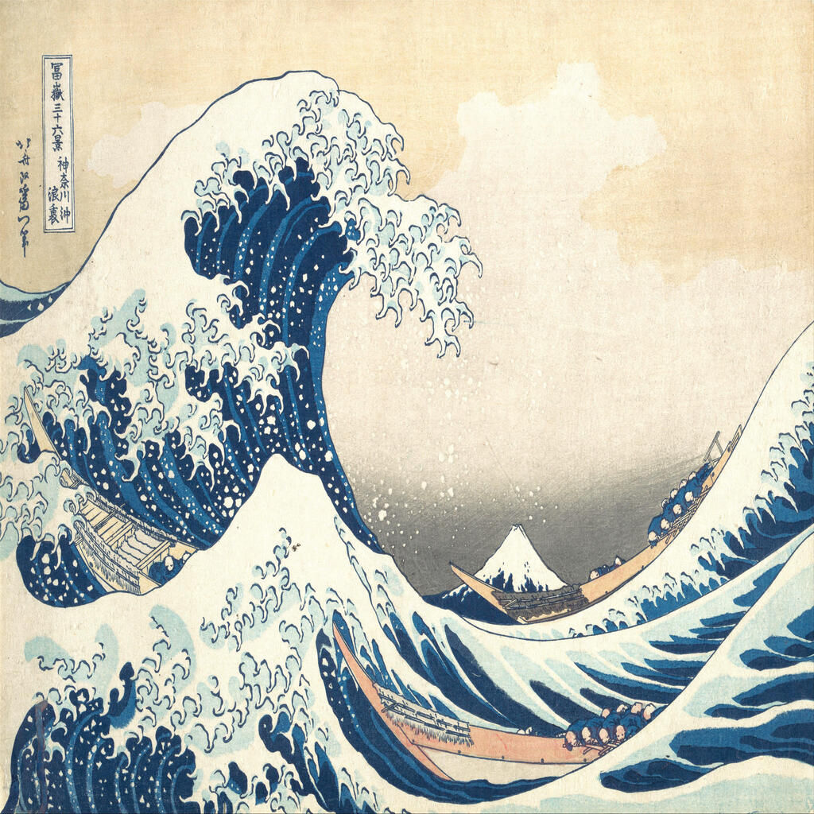
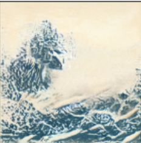

End image and its approximated image

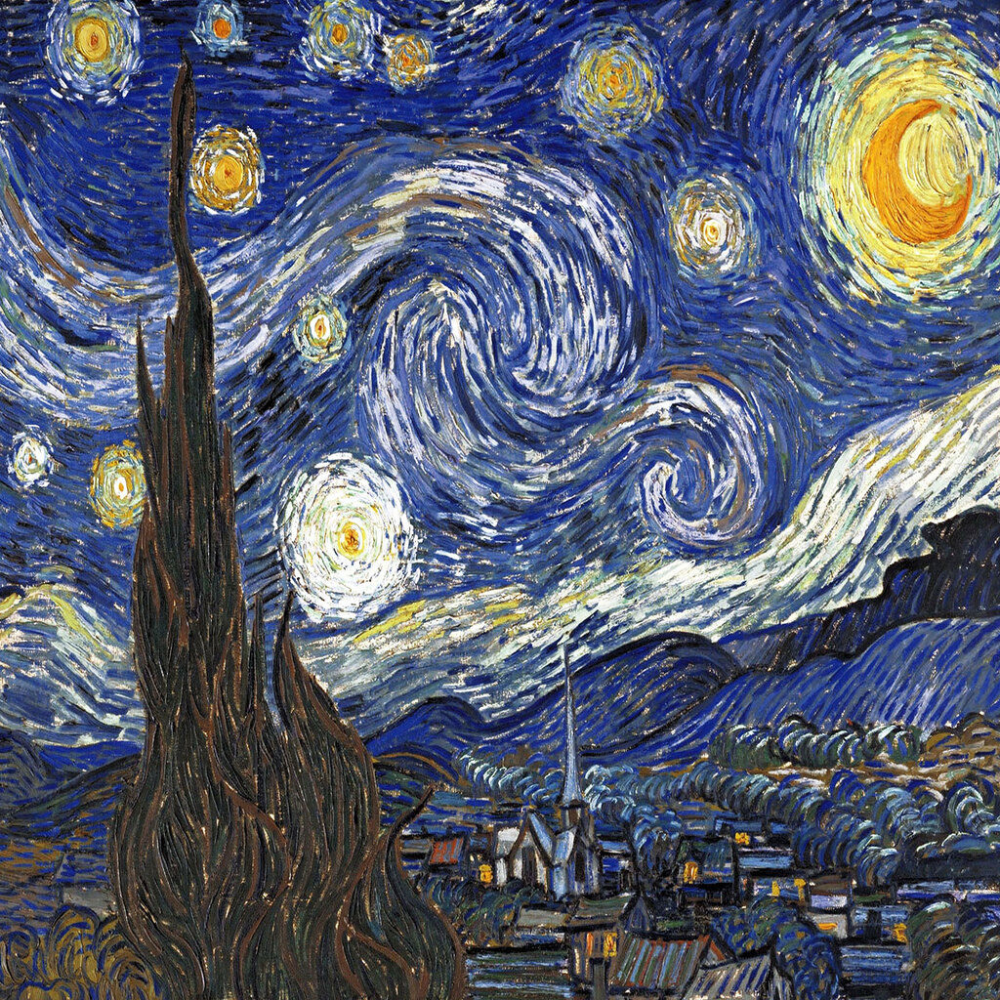
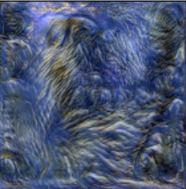

Approximated Morphing 

### __Car Morphing__:

- The following three morphings were achieved using the StyleGAN cat model published by NVIDIA.
- The first two morphings are morphing from a randomly generated image to another randomly generated image.
- 
__Morphing 1__:
start and end images

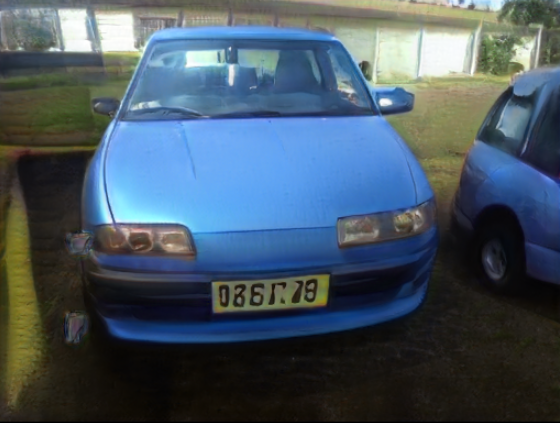
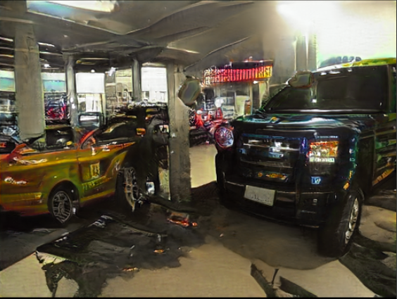

result morphing

__Morphing 2__:
start and end images

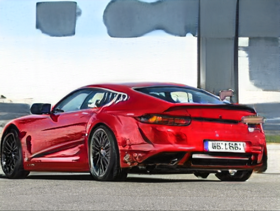
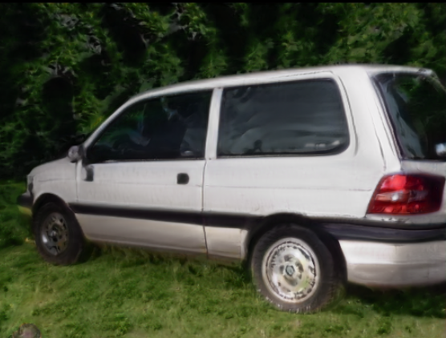

result morphing

### __Cat Morphing__:
- The following three morphings were achieved using the StyleGAN cat model published by NVIDIA.
- The first two morphings are morphing from a randomly generated image to another randomly generated image.
  
__Morphing 1__:
start and end images

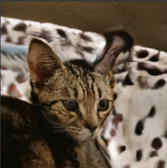
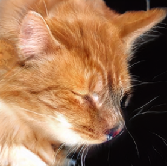

result morphing

__Morphing 2__:
start and end images

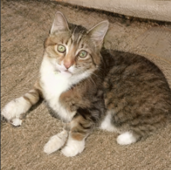
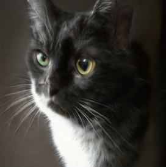

result morphing

__Morphing 3__:
Our third morphing is made using approximated images from our input images. 
We provide three morphings(one each for 500, 1000, and 1500 steps).

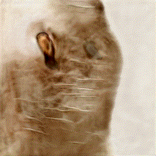
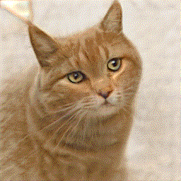
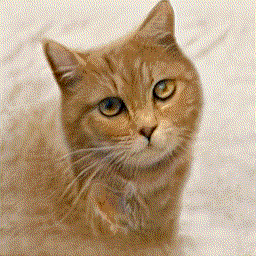

## Conclusion
In this project, we have experimented with the StyleGAN published bu NVIDIA to generate images for morphing videos. 
In particular, we have tried two approaches for approximating the latent space of the StyleGAN. For human face, we could see that encoder4editor performed especially better than the brute method of trying to minimizing the MSE of input images and generated images. For other three datasets, we could expect the same behavior, but for lack of resources and time, we took the brute approach in trying to approximate the latent vectors for our input images. 

